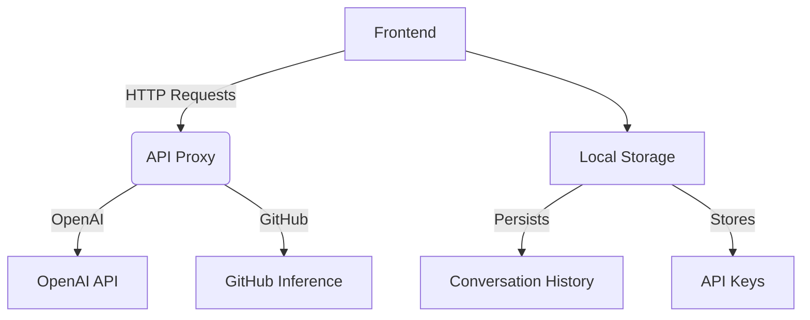

```mermaid
graph TD;
    A[Frontend] -->|HTTP Requests| B(API Proxy)
    B -->|OpenAI| C[OpenAI API]
    B -->|GitHub| D[GitHub Inference]
    A --> E[Local Storage]
    E -->|Persists| F[Conversation History]
    E -->|Stores| G[API Keys]
```